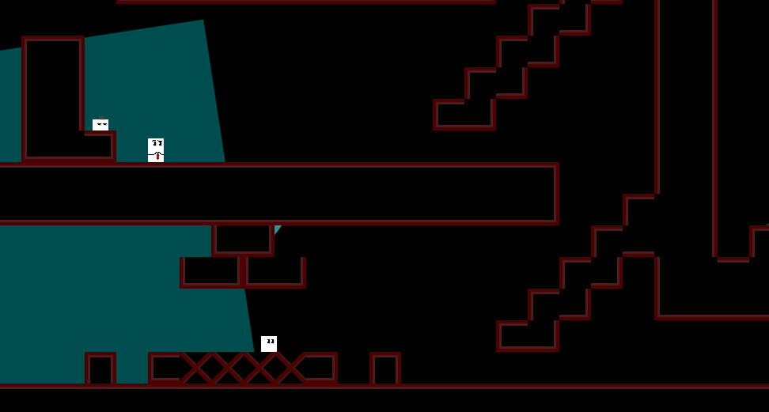
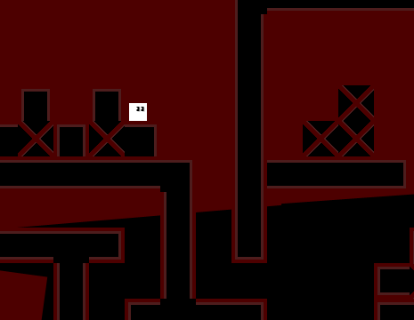
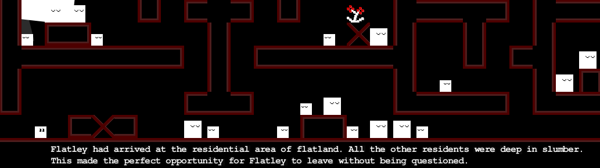
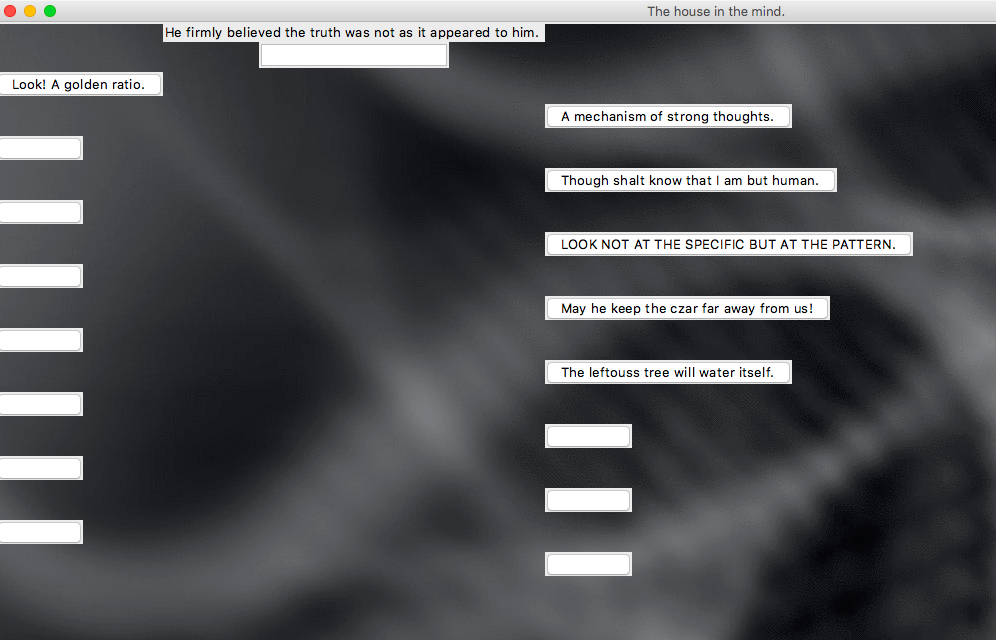
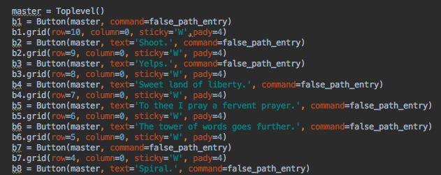
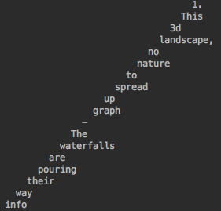
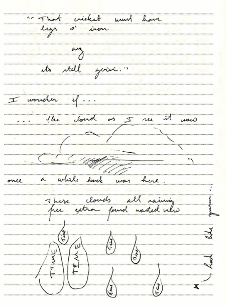
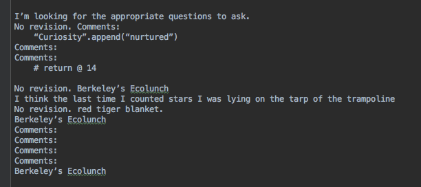
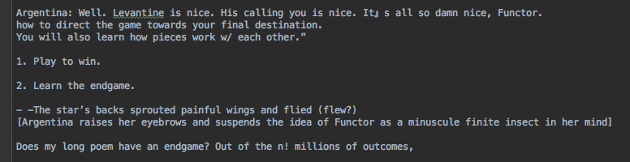

# softwareEnginerding

This repository contains projects I contributed to or personally completed in software engineering.

## Table of contents
* [General info](#general-info)
* [FlatQuest](#FlatQuest)
* [Poetry Projects](#PoetryProjects)

## General Info

I worked on these projects in college (2017 - 2018). [FlatQuest](#FlatQuest)
was a culminating project for a software engineering course designed
to teach fundamental development practices. I GitHubbed and Scrummed for this project in a team with three other undergraduate
students. [Poetry Projects](#Poetry-projects) arose naturally as part of two poetry courses
I took (Ecopoetics and Advanced Poetry). While not required for the courses, I decided
spicing up poetry with computer science (and vice versa) would make everything more interesting.

## FlatQuest

Inspired by exacting professors and the desire to build a beautiful game, I collaborated in a
team of four undergraduate students to produce a quirky side scrolling platforming game.

The game follows Flatley, a square, as it progresses through various levels in FlatLand.
I won't spoil the story line here, but we drew a small bit of inspiration from Edwin Abbott's
book - Flatland, and Thomas Was Alone's narration style.

## Gameplay

● Use ‘WASD’ or the arrow keys to move Flatly around the screen to explore new territory

● Press ‘Q’ to spawn and despawn Flatly’s shadow to assist with high jumps

● ‘SHIFT’ to to switch between controlling Flatly or his shadow

● ‘SPACE’ to pause the game

● Explore the level until Flatly finds a portal in order to proceed to the next level (5 total
levels)

Tips:

● Read the text to fully immerse yourself in Flatly’s story and world (*** and also get a few
hints of how to succeed in the game along the way ***)

● Button trick for a high jump: ‘W’ -> ‘Q’ -> ‘W’ -> ‘SHIFT’

● Explore the level to find hidden narration

#### How to access

Navigate to the FlatQuest/dist folder and click on the FlatQuest.jar file. The file has been configured to run
as an executable so no need for programming IDE's!

#### Musical notes

The music used for the game is by Dexter Britain and is under a cc license (check him out at www.dexterbritain.com).

#### Packages used

We used Slick2D as the base for the game development.

## Poetry Projects

Is writing code poetry or is poetry writing code? I think the answer is yes. In these projects, I explore how coding aids and eventually becomes poetry.

### Ecopoetics - poetry about and with the coding environment

I created a GUI as an experiential add on to the poetry I wrote in a college class.
The overall experience requires an understanding of source code, and a constant back and forth between GUI and source code.

The first stage of the GUI will leave you perplexed (as it should).

You can hover over buttons and see the text change. Clicking on the buttons reveals texts, and you can
try writing in the search box to see if you can move forward. You'll find that trying to figure out how to
proceed becomes easier after looking at the source. It may offer hints as how to progress.

A text and spacing randomizer also produces poetry every time a button is pressed.
The randomizer takes text from poetry already written and combines it in unexpected ways.

The final reward is seeing pages of the original handwritten poetry.

How long will it take you to get there?

#### How to access

Navigate to the Ecopoetics folder and run 'A house of nodes.py'.

#### Packages used

* tkinter
* random

### RandomPoetry - eliminating choice

Artists regularly talk about the importance of choice in their work. Photographers choose what
to take a snapshot of, musicians decide how to combine notes, and coders enjoy free reign in
designing programs.

I thought having a program decide randomly on what to write poetry about would yield interesting.
Here's one example.

The program takes previously written poetry and tries to put it together in a new
random way. In some cases (like above), it almost feels like it could make sense.
In others, it feels eerie.

#### How to access

Navigate to RandomPoetry and open Briefcase.py for code. To see the poetry produced
by the code, take a look at any text file having 'Investigate' in it (the Experiments
directory contains a number of these).

#### Packages used

* random

